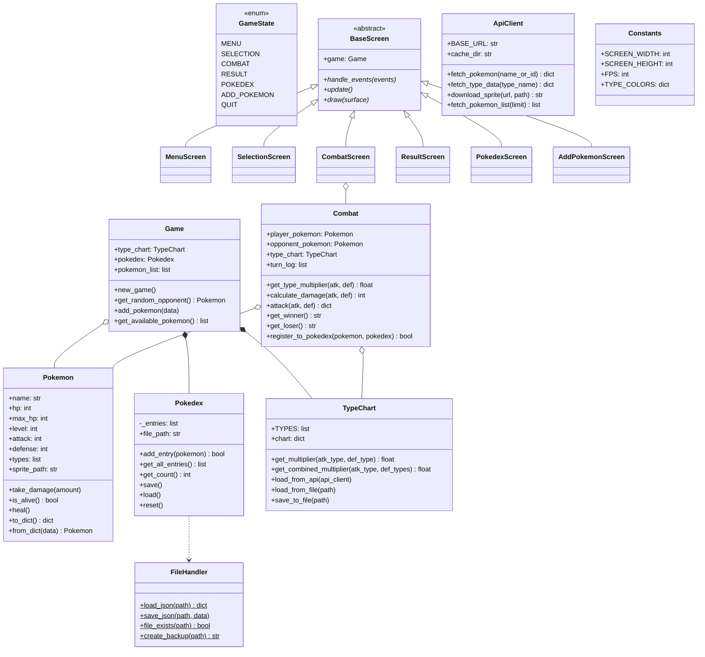

# Pokemon Battle

A Pokemon battle game built with Python and Pygame. Includes type effectiveness, a Pokedex system, and custom Pokemon creation.

## Setup

```bash
# Create virtual environment
py -m venv .venv

# Activate (Windows / Git Bash)
source .venv/Scripts/activate

# Install dependencies
pip install -r requirements.txt

# (Optional) Populate Pokemon data from PokeAPI
py scripts/populate_pokemon.py

# Run the game
py main.py

# Run tests
py -m pytest tests/ -v
```

## How to Play

1. **Start Battle** -- Select a Pokemon from your roster, then battle a random opponent. Click "Attack!" to deal damage. Type effectiveness applies (fire > grass > water > fire).
2. **Add Pokemon** -- Create a custom Pokemon by entering a name, stats, and selecting up to 2 types.
3. **Pokedex** -- View all Pokemon you have encountered in battles. Duplicates are automatically prevented.

## Project Structure

```
pokemonv1/
  main.py               -- Entry point (Pygame loop + state machine)
  game_state.py          -- GameState enum
  pokemon.py             -- Pokemon class
  combat.py              -- Combat class (5 required methods)
  pokedex.py             -- Pokedex class (persistence + anti-duplicate)
  type_chart.py          -- TypeChart class (18 types)
  game.py                -- Game class (orchestrator)
  gui/
    constants.py         -- Constants class (colors, dimensions)
    base_screen.py       -- BaseScreen abstract class
    menu_screen.py       -- MenuScreen
    selection_screen.py  -- SelectionScreen
    combat_screen.py     -- CombatScreen
    result_screen.py     -- ResultScreen
    pokedex_screen.py    -- PokedexScreen
    add_pokemon_screen.py -- AddPokemonScreen
  utils/
    file_handler.py      -- FileHandler (JSON I/O)
    api_client.py        -- ApiClient (PokeAPI)
  data/
    pokemon.json         -- Available Pokemon (generated)
    pokedex.json         -- Encountered Pokemon (runtime)
    type_chart.json      -- 18x18 type effectiveness table
    default_pokemon.json -- Fallback if PokeAPI unavailable
  scripts/
    populate_pokemon.py  -- Fetch data from PokeAPI
  tests/                 -- Unit tests (pytest)
```

## Class Diagram



## Combat Mechanics

- **Turn order**: Player attacks first, then opponent
- **Type effectiveness**: Official Pokemon 18-type chart (fire > grass > water > fire, etc.)
- **Dual type defense**: Multipliers combine (fire vs grass/ice = 4.0x)
- **Damage formula**: `max(1, attack * type_multiplier - defense)`
- **Miss rate**: 10% fixed chance
- **Immunity**: 0x multiplier = 0 damage ("It had no effect!")

## Technologies

- Python 3.10+
- Pygame 2.5+
- PokeAPI (initial data population)
- pytest (testing)
